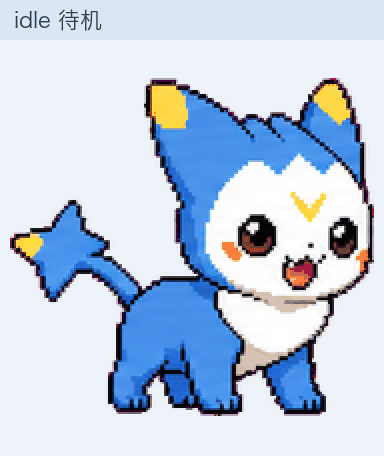
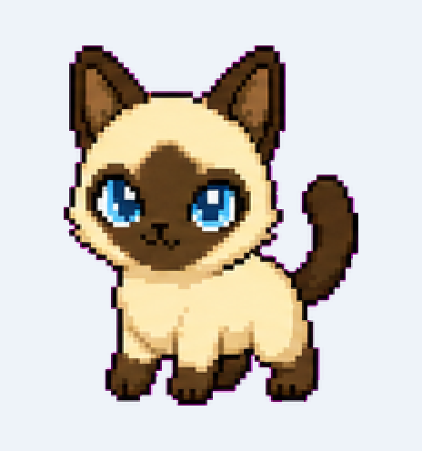
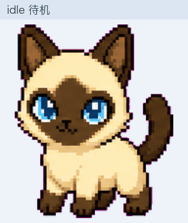
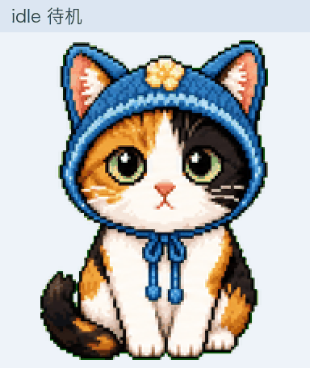
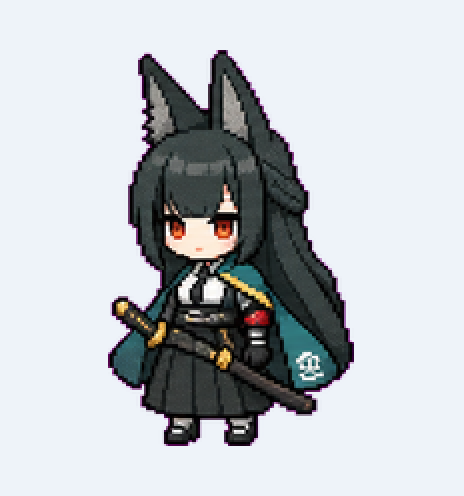
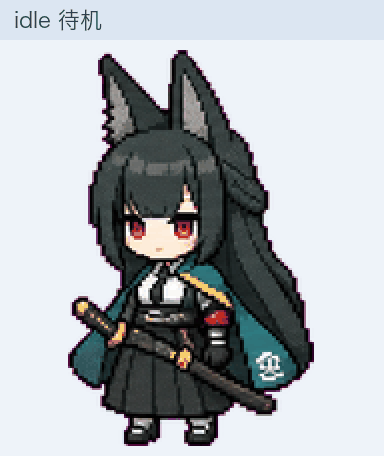
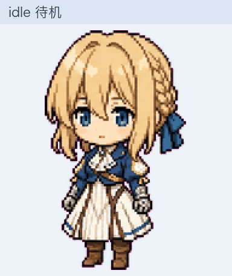

# kimi-work-pets

把 [Codex 社区桌宠](https://codexpets.net/)装进 **Kimi Work 桌面端**(macOS / Windows)。

在线浏览全部宠物与效果演示:[**caseclose.github.io/kimi-work-pets**](https://caseclose.github.io/kimi-work-pets/)

Kimi Work 内置桌宠除默认 Rive 形象外,还支持精灵图(spritesheet)模式,与 Codex 社区宠物素材(8×9 网格、192×208 单元格)格式同源。本仓库提供转换、安装、回滚工具;社区画廊里的宠物按同样流程都可以装。

## 内置宠物

`pets/` 下每只宠物一个目录,安装命令为 `python3 scripts/install.py pets/<目录名>`:

| 宠物 | 预览 | 状态演示 |
| --- | --- | --- |
| **Dimo(迪莫)**,《洛克王国》光属性明星宠物([角色背景](https://baike.baidu.com/item/%E8%BF%AA%E8%8E%AB/10570042);社区二创,作者 [swrited](https://codexpets.net/gallery/dimo)) |  |  |
| **Siam(暹罗猫)**,小体型暹罗猫(作者 [allen](https://codexpets.net/gallery/siam)) |  |  |
| **Maomao(大开门)**,戴蓝色钩针帽的三花猫(作者 [kyle](https://codexpets.net/gallery/maomao)) |  |  |
| **Hiyuki**,持冰剑的银发红瞳 Q 版少女(作者 [foxibu](https://codexpets.net/gallery/hiyuki)) |  |  |
| **Feixue(绯雪)**,冷艳巫女风 Q 版少女(作者 [Akira97](https://codexpets.net/gallery/feixue)) |  |  |
| **GUGUGAGA**,企鹅装 Q 版少女(作者 [Hibik1](https://codexpets.net/gallery/endminguga)) |  |  |
| **Round Cola Hatch**,喝可乐的蓝色圆滚滚机器人(作者 [tsang](https://codexpets.net/gallery/round-cola-hatch)) |  |  |
| **胡桃(Hu Tao)**,《原神》往生堂堂主,带小幽灵(作者 [Barometer](https://codexpets.net/gallery/hu-tao-pet);形象版权归米哈游) |  |  |
| **Flamy**,戴破碎眼镜敲笔记本的红色小火龙(作者 [inwizzy](https://codexpets.net/gallery/flamy)) |  |  |
| **Kimlet Move Wave**,像素风挥手人物(作者 [kimehwa](https://codexpets.net/gallery/kimlet-move-wave);⚠️ 真人形象戏仿,介意请勿安装) |  |  |
| **Kimlet**,带光环挥手人物(作者 [kimehwa](https://codexpets.net/gallery/kimlet);⚠️ 真人形象戏仿,介意请勿安装) |  |  |
| **星见雅(Miyabi)**,《绝区零》对空六课狐耳剑士(作者 [Eric-Terminal](https://codexpets.net/gallery/miyabi);形象版权归米哈游) |  |  |
| **薇尔莉特(Violet)**,《紫罗兰永恒花园》自动手记人偶(作者 [Lazenca](https://codexpets.net/gallery/violet);形象版权归京都动画) |  |  |
| **咕嘎(Guga)**,圆润版企鹅装连帽少女(作者 [CIRCUS](https://codexpets.net/gallery/guga)) |  |  |

## 快速开始

要求:Kimi Work 桌面端、`python3`。支持 **macOS / Windows**(Windows 路径按 Electron
惯例定位 `%APPDATA%\kimi-desktop`,未经真机验证;若定位失败,各脚本均支持
`--appdata <Kimi应用数据目录>` 手动指定)。

```bash
git clone https://github.com/caseclose/kimi-work-pets.git
cd kimi-work-pets
python3 scripts/install.py pets/dimo   # 换成 pets/ 下任意目录名即可
```

重启 Kimi 应用(或重新开关桌宠)后生效,桌宠已带悬停交互(见下节)。
回滚默认形象:`python3 scripts/restore.py`(原配置自动备份在用户目录的 `.kimi-work-pet-backup/`)。

## 安装其他社区宠物

1. 从 [CodexPets.net](https://codexpets.net/)(或 petdex.dev 等画廊)下载宠物包并解压(内含 `pet.json` + `spritesheet.webp`);
2. 转换:`python3 scripts/convert-codex-pet.py <目录>`(自动统计每行实际帧数,原清单备份为 `pet.codex.json`);
3. 安装:`python3 scripts/install.py <目录>`。

转换器按标准 9 行布局映射动作:

| 行 | 语义 | Kimi Work 状态 |
| --- | --- | --- |
| 0 | idle | 空闲 |
| 1 | running_right | 向右拖动 |
| 2 | running_left | 向左拖动 |
| 3 | waving | 空闲彩蛋 1 |
| 4 | jumping | 空闲彩蛋 2 |
| 5 | failed | 失败 |
| 6 | waiting | 等待确认 |
| 7 | running | 工作中 |
| 8 | review | (未映射) |

布局不符时,用 `scripts/inspect_spritesheet.py` 逐行确认动作后手动调整 `pet.json`;
manifest 字段与宿主状态映射详见 [docs/how-kimi-work-pet-works.md](docs/how-kimi-work-pet-works.md)。

## 交互行为

安装即自带,无需额外操作(`restore.py` 会一并还原页面、全部撤销):

- **悬停招手**:鼠标悬停桌宠时,播放招手动作(`idle_random_1`)一个循环后回到待机,
  6 秒冷却,不影响工作/等待等状态。
- **视线跟随**:鼠标在桌宠附近移动时,宠物平滑地向光标方向倾斜、偏移,离开后回正
  (CSS transform 近似"脑袋偏向";仅精灵图宠物,Rive 宠物自带眼动状态机会自动跳过)。
- **拖动奔跑**:拖动桌宠时朝拖动方向奔跑(应用原生行为)。
- **显示与响应范围**:宠物显示为默认的 2 倍大小;悬停/点击的响应范围在宠物轮廓外
  再外扩 24px,不用精确对准(由页面主动上报可交互区域实现)。

交互由三个安装时自动注入的补丁实现(均幂等,可单独重复运行,
可加 `--appdata` 指定应用数据目录):
[patch-hover-interaction.py](scripts/patch-hover-interaction.py) ·
[patch-look-at-cursor.py](scripts/patch-look-at-cursor.py) ·
[patch-pet-display.py](scripts/patch-pet-display.py)。

## 版权

- 代码:MIT(见 LICENSE)。
- **社区原创素材**(siam/maomao/hiyuki/feixue/endminguga/round-cola-hatch/flamy/guga):
  来自 Codex 社区画廊,版权以各来源页面为准,**仅供个人非商业使用**。
- **含第三方 IP 形象**:
  - dimo:社区二创(作者 swrited,CC BY-NC 类协议);迪莫形象来自腾讯《洛克王国》,权利归原版权方。
  - hu-tao-pet:胡桃形象来自米哈游《原神》;miyabi:星见雅形象来自米哈游《绝区零》;
    violet:薇尔莉特形象来自京都动画《紫罗兰永恒花园》——权利均归原版权方。
- **戏仿内容**(kimlet/kimlet-move-wave):含真实公众人物形象,**仅供个人非商业使用**,介意者可不安装。
- 本仓库与 Moonshot AI、OpenAI 无任何隶属或授权关系。

## English

Install Codex community pets as the desktop pet of the Kimi Work desktop app (macOS/Windows).
Run `python3 scripts/install.py pets/<dir>` for any of the 14 bundled pets (see the gallery
table above; includes Dimo from Tencent's *Roco Kingdom*, a Siamese cat, a calico cat,
several original chibi characters, Hu Tao from *Genshin Impact*, Hoshimi Miyabi from
*Zenless Zone Zero*, Violet Evergarden, and two pixel-art public-figure parodies).
Convert new pets with `scripts/convert-codex-pet.py`, roll back with `scripts/restore.py`.
Installation also injects hover interactions: the pet waves back when you hover over it,
and sprite pets lean toward the cursor as you move the mouse around.
All scripts accept `--appdata <dir>` if the app data folder is located elsewhere.
Manifest format and host-state mapping: [docs/how-kimi-work-pet-works.md](docs/how-kimi-work-pet-works.md).
Code is MIT; bundled assets are community fan art (CC BY-NC, personal use only).
Not affiliated with Moonshot AI or OpenAI.
